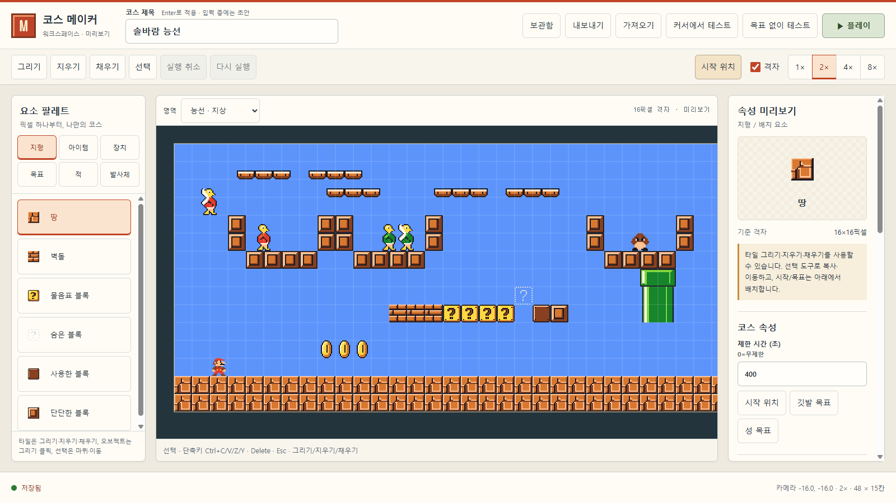
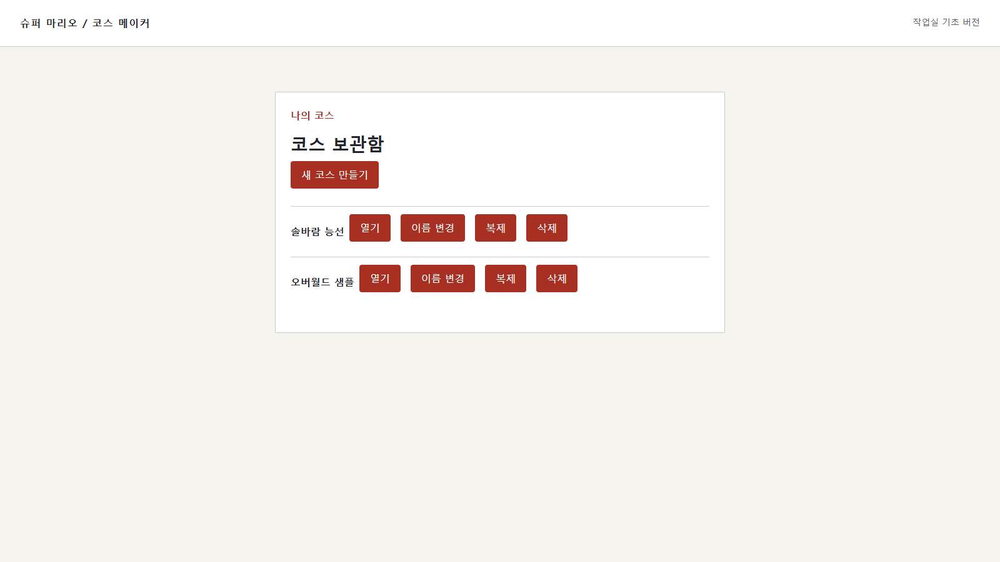
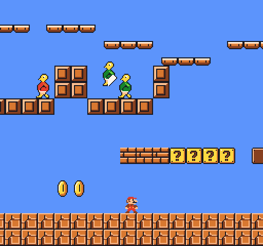
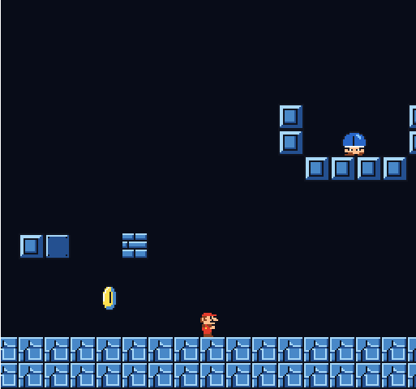
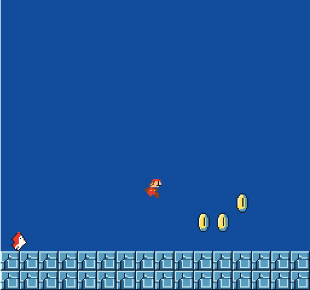
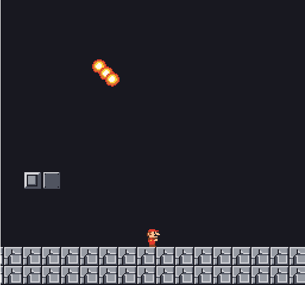
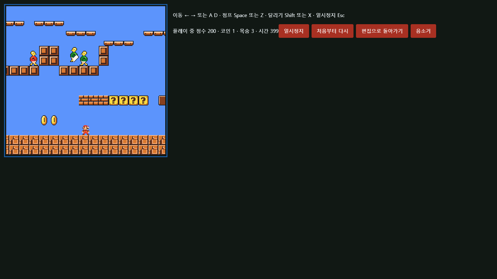
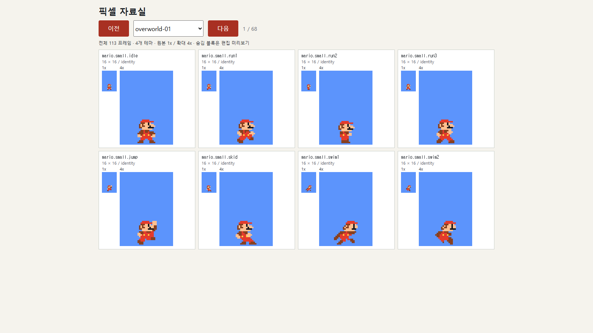

<div align="center">

# 🍄 슈퍼 마리오 코스 메이커

**브라우저에서 만드는 나만의 SMB1 스타일 코스 — 그리고, 바로 플레이하고, 파일로 공유하세요**

[English](README.md) · [한국어](README.ko.md) · [简体中文](README.zh-CN.md)

[](https://bun.sh)
[](https://www.typescriptlang.org)
[](#-기술-스택)
[](LICENSE)



</div>

---

## ✨ 특징

<table>
<tr>
<td width="50%">

### 🖌️ 완전한 코스 편집기
- 그리기 · 지우기 · 사각 채우기 · 선택/이동/복사/붙여넣기
- 실행 취소/다시 실행 (제스처 단위, 최대 200단계)
- 1x–8x 줌 · 팬 · 16px 격자 스냅
- 카테고리 팔레트 + 배치된 오브젝트의 **속성 인스펙터**
- 시작 위치 · 깃발 목표 · 성 목표 · 파이프 연결/워프존
- 여러 에어리어(지상 ↔ 지하 등) 생성·연결

</td>
<td width="50%">

### 🎮 실제로 플레이되는 게임
- 달리기 · 가변 점프 · 웅크리기 · 수영 · 덩굴 등반
- 작은 → 슈퍼 → 파이어 마리오, 스타, 1UP
- 스톰프 · 등껍질 콤보 · 파이어볼 전투
- 코인 · 점수 · 목숨 · 타이머 · 깃발/도끼 엔딩
- 편집 ↔ 플레이테스트 즉시 전환 (작성 상태 완전 복원)

</td>
</tr>
<tr>
<td>

### 🗺️ 4가지 테마 · 전체 SMB1 오브젝트
- **지상 · 지하 · 수중 · 성**
- 굼바, 초록/빨강 쿠파 & 파라트루파, 피라냐, 버즈, 대포/킬러, 해머 브로, 라키투, 치프치프/블루퍼, 포도부, 파이어바, 쿠파 + 도끼 다리
- 움직이는/떨어지는/균형 플랫폼, 스프링, 숨은 블록, 덩굴

</td>
<td>

### 💾 로컬 우선 저장
- IndexedDB **자동 저장** + 리비전 충돌 감지
- 코스 보관함: 열기/이름 변경/복제/삭제
- `.smb1.json` **보내기/가져오기** — 완전 검증되는 이식 가능한 포맷
- 계정 없음 · 서버 없음 · 설치 없음

</td>
</tr>
</table>

🎵 칩튠 사운드트랙(테마별 BGM + 효과음)은 Web Audio로 실시간 합성됩니다.

> **솔직한 범위 안내** — 계정, 온라인 공개, 공유 서버, 멀티플레이, 모바일 편집기는 없습니다. 브라우저 IndexedDB 저장은 **영구 백업이 아닙니다**: 사이트 데이터 삭제·저장 공간 회수·다른 프로필 사용 시 사라질 수 있으므로, 남는 백업은 **보내기**로 받은 JSON 파일입니다. 원작 버그·프레임 단위 일치는 약속하지 않습니다.

---

## 📸 스크린샷

<div align="center">

<p><sub>코스 보관함 — 새로 만들기 · 열기 · 이름 변경 · 복제 · 삭제</sub></p>

<table>
<tr>
<td></td>
<td></td>
</tr>
<tr>
<td></td>
<td></td>
</tr>
</table>
<p><sub>지상 · 지하 · 수중 · 성 — 4가지 테마 플레이</sub></p>


<p><sub>에디터 안에서 바로 플레이테스트 — 점수 · 코인 · 목숨 · 시간 HUD</sub></p>


<p><sub>113개 프레임 · 4개 테마 팔레트 — 전부 직접 그린 픽셀 아트</sub></p>
</div>

---

## 🚀 시작하기

[Bun](https://bun.sh) 1.4+ 만 있으면 됩니다. (다른 런타임 의존성 없음)

```bash
bun install        # 개발 의존성 설치
bun run dev        # 개발 서버 (http://127.0.0.1:4173)
```

빌드 후 미리보기:

```bash
bun run build      # dist/ 에 브라우저 번들 생성
bun run preview    # dist 서빙 (http://127.0.0.1:4173)
```

브라우저에서 `http://127.0.0.1:4173`을 열고 **새 코스 만들기** → **작업실 열기** → **▶ 플레이**.

> 💡 네 가지 테마의 샘플 코스(`솔바람 능선` · `등잔 굴` · `청파 수로` · `불씨 성`)는 `src/level/samples.ts`에 있습니다. JSON으로 저장한 뒤 작업실 도구 모음의 **가져오기**로 열 수 있습니다 — 보관함 첫 화면에는 파일 열기가 없습니다.

자세한 조작 상세는 [`docs/controls.md`](docs/controls.md), 파일 형식은 [`docs/format.md`](docs/format.md), 그림·음악 출처는 [`docs/assets.md`](docs/assets.md)를 보세요.

## 🕹️ 조작법

| 플레이 | 키 |
| --- | --- |
| 이동 | `←` `→` 또는 `A` `D` |
| 점프 / 수영 | `Space` 또는 `Z` |
| 달리기 / 파이어볼 | `Shift` 또는 `X` |
| 웅크리기 / 파이프 진입 | `↓` 또는 `S` |
| 덩굴 타기 | `↑` |
| 일시정지 | `Esc` |

| 에디터 | 키 / 동작 |
| --- | --- |
| 실행 취소 / 다시 실행 | `Ctrl+Z` / `Ctrl+Y` |
| 복사 / 붙여넣기 / 삭제 | `Ctrl+C` / `Ctrl+V` / `Delete` |
| 선택 해제 | `Esc` |
| 화면 이동 | 휠 드래그 또는 `Space`+드래그 |
| 줌 | `1x`–`8x` 버튼 (포인터 기준) |

## 🗂️ 코스 파일 형식

코스는 확장자 `.smb1.json`의 **버전 관리된 JSON 문서**(`format: "smb1-maker", version: 1`)로 보내고 가져올 수 있습니다.

- 희소 타일 맵 + 좌표·속성이 있는 배치 오브젝트 목록
- 파이프 목적지 · 균형 플랫폼 쌍 · 워프존 슬롯 등 교차 참조는 쌍방 검증
- 최대 32 MiB, 16개 에어리어 — 가져오기는 항상 원자적: 실패해도 열린 코스를 덮어쓰지 않습니다
- 잘못된 JSON/버전/참조는 구체적인 오류 코드(`malformed_json`, `invalid_reference` …)와 함께 거부

## 🧱 기술 스택

| 영역 | 선택 |
| --- | --- |
| 언어 | TypeScript (`strict`, `noUncheckedIndexedAccess`) |
| 렌더링 | Canvas 2D — 256×240 논리 해상도, 픽셀 퍼펙트 스케일링 |
| 시뮬레이션 | 고정 60Hz 스텝, 결정적 · DOM 비의존 (`src/game`) |
| 오디오 | Web Audio API 실시간 칩튠 합성 |
| 저장 | IndexedDB 트랜잭션 자동저장 + 파일 import/export |
| 툴링 | Bun (dev/build/test) · Biome · Playwright 실브라우저 QA |
| 런타임 의존성 | **없음** — 게임/UI 프레임워크 없이 순수 DOM + Canvas |

```
src/
├── game/       고정스텝 시뮬레이션 (물리·충돌·적·아이템·골)
├── editor/     편집 명령 · 히스토리 · 페인트 · 선택 · 에어리어
├── level/      코스 스키마 · 검증 · 직렬화 · 카탈로그 · 샘플
├── render/     픽셀 아트 아틀라스 · 씬 렌더러
├── audio/      칩튠 스케줄러 · 악기 · 효과음
├── storage/    IndexedDB · 자동저장 · 보관함 · 파일
└── ui/         라이브러리 · 에디터 · 인스펙터 · HUD
```

## ✅ 개발

```bash
bun test               # 단위/통합 테스트 (27개 스위트)
bun run typecheck      # tsc --noEmit
bun run diagnostics    # 코드 진단
bun run qa --scenario all --evidence <dir>   # 실브라우저 QA 시나리오
bun run scripts/screenshots.ts               # 이 README의 스크린샷 재생성
```

모든 스크린샷은 실제 빌드된 앱에서 캡처했습니다. 재생성하려면 `bun run preview`를 띄운 뒤 위 스크립트를 실행하세요 (`PREVIEW_ORIGIN`으로 주소 지정 가능).

## 📜 라이선스

[MIT](LICENSE) — 코드와 이 저장소에서 직접 제작한 픽셀 아트/음악 데이터.

> ⚠️ 이 프로젝트는 Nintendo와 무관한 비공식 팬 프로젝트입니다. *Super Mario Bros.* 관련 명칭·캐릭터의 모든 권리는 Nintendo에 있으며, 여기의 스프라이트와 음악은 ROM/원본 에셋이 아닌 **재해석된 오리지널 제작물**입니다. 상업적 사용은 권장하지 않습니다.
